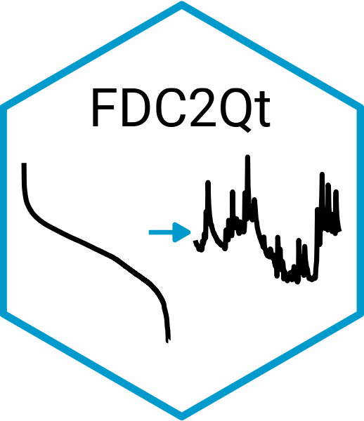

# FDC2Qt 

This repository provides tools for predicting **hydrologically consistent streamflow series** in ungauged basins using a **simplified regional approach**.

## Features
- Regional parameter estimation for ungauged catchments
- Streamflow series generation with hydrological consistency
- Example datasets and workflows

## Installation
```r
# Install from GitHub
devtools::install_github("alanspado98/FDC2Qt")


